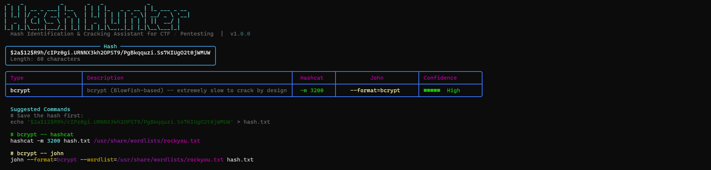
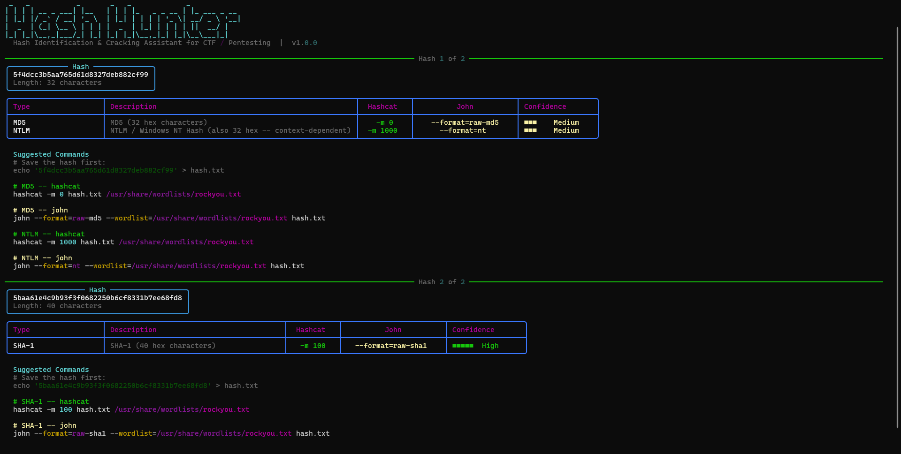
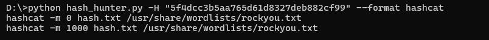

# Hash Hunter 🔑
> Hash identification and cracking assistant for CTF players and pentesters



## Features
- Identifies MD5, NTLM, SHA-1, SHA-256, SHA-512, bcrypt, MySQL4+, PostgreSQL MD5, Base64
- Shows hashcat `-m` mode and john `--format` for every identified hash
- Suggests ready-to-run crack commands with correct wordlist path
- Batch mode: analyze a full file of hashes at once (`-f`)
- `--identify-only` flag for quick lookups without command noise
- `--format` flag for pipeable output — prints only john or hashcat commands to stdout

## Supported Hash Types

| Type | Hashcat Mode | John Format | Confidence |
|------|-------------|-------------|------------|
| MD5 | `-m 0` | `--format=raw-md5` | Medium (ambiguous with NTLM) |
| NTLM | `-m 1000` | `--format=nt` | Medium (ambiguous with MD5) |
| SHA-1 | `-m 100` | `--format=raw-sha1` | High |
| SHA-256 | `-m 1400` | `--format=raw-sha256` | High |
| SHA-512 | `-m 1800` | `--format=raw-sha512` | High |
| bcrypt | `-m 3200` | `--format=bcrypt` | High |
| MySQL4+ | `-m 300` | `--format=mysql-sha1` | High |
| PostgreSQL MD5 | N/A | N/A | Medium (not directly crackable) |
| Base64 | N/A | N/A | Low (decode first) |

## Installation

```bash
git clone https://github.com/ryanmoradyan/hash-hunter.git
cd hash-hunter
pip install -r requirements.txt
```

## Usage

```bash
python hash_hunter.py -H "<hash>"
python hash_hunter.py -f hashes.txt
python hash_hunter.py -H "<hash>" --identify-only
python hash_hunter.py -H "<hash>" --format hashcat
python hash_hunter.py -H "<hash>" --format john
python hash_hunter.py -H "<hash>" --crack --wordlist /usr/share/wordlists/rockyou.txt
```

## Screenshots

### Batch mode — multiple hashes from a file


### Pipeable output


## Why I Built This
Built while working through HackTheBox machines — tired of googling hash formats and hashcat modes mid-box. One command identifies the hash, gives you the crack command, and gets out of the way.

## License
MIT
